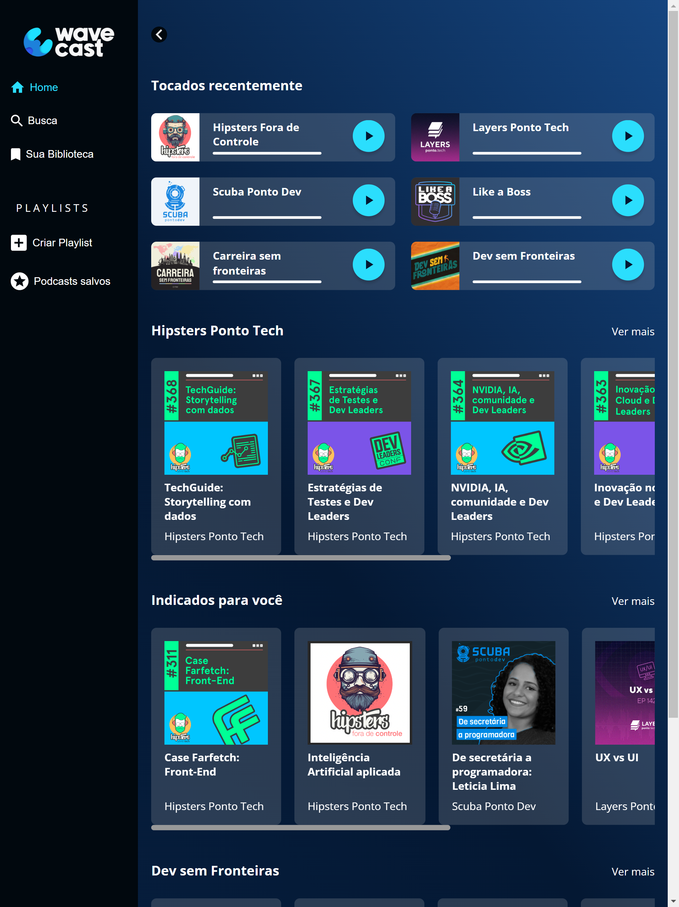

# Frontend Mentor - Four card feature section solution

This is a solution to the [CSS: construindo layouts com Grid](https://cursos.alura.com.br/course/css-construindo-layouts-com-grid). The structure was pre-assembled so that the lessons tasks were focused on applying responsiveness with the grid layout

## Table of contents

- [Overview](#verview)
  - [The lesson](#the-challenge)
  - [Screenshot](#screenshot)
  - [Links](#links)
- [My process](#my-process)
  - [Built with](#built-with)
  - [What I learned](#what-i-learned)
- [Author](#author)

## Overview

### The challenge

Users should be able to:

- View the optimal layout for the site depending on their device's screen size

### Screenshot

### Links

- Solution URL: [WaveCast on GitHub]()
- Live Site URL: [WaveCast on VERCEL]()

## My process
Starting with the general division of the page, I applied grid to index.css. Using grid-tamplate-area to divide each field on the page.
Then I went to the side menu, creating a menu.css file.Applying grid-tamplate-rows and gap.
The next step was the organization of the sections in the main field. It took the longest, counting on the adjustments made to the cards. For this, two more files were created: secao.css and cartao.css.
All css files were appended in the head field of the index.HTML file.
Finally, the navbar.css file was created to handle the navigation bar, which is responsive to mobile screens. And Flexbox was applied too.
And all responsiveness was handled throughout development.

### Built with

- CSS custom properties
- Flexbox
- CSS Grid
- CSS Flexbox

### What I learned

How to apply responsiveness using grid and the grid itself. I use Flexbox, but Grid Layout has greater flexibility when positioning fields

## Author

- Website - [Mariana Candido - M4R0C4](https://github.com/M4R0C4)
- Frontend Mentor - [@M4R0C4](https://www.frontendmentor.io/profile/M4R0C4)
- LinkedIn - [Mariana Candido](https://www.linkedin.com/in/mariana-candido-20b59b88/)

